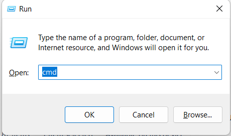
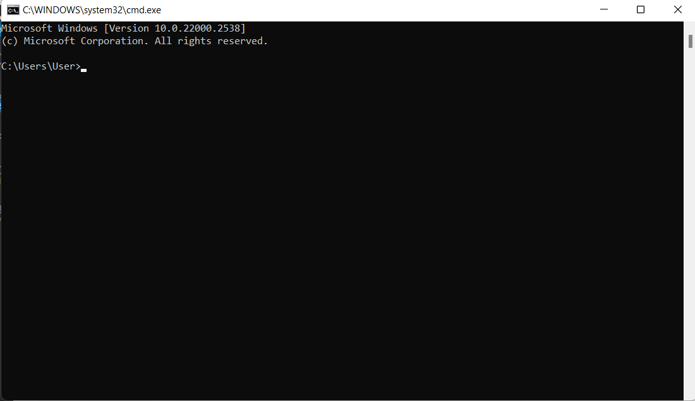
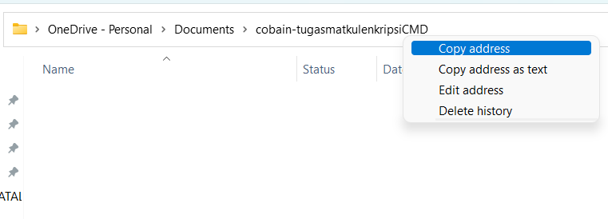
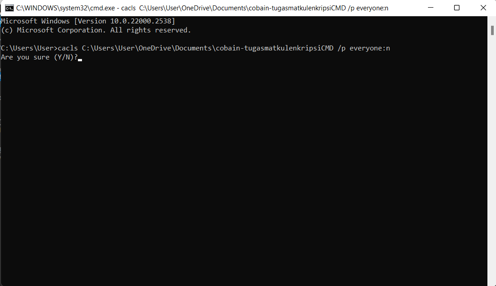
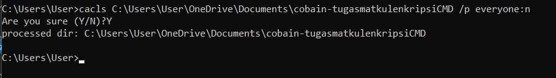
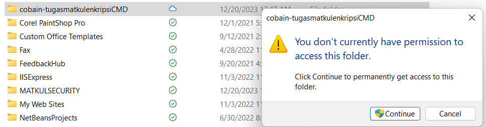
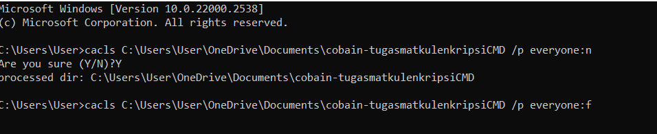
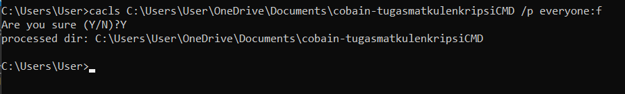

# MATKULSECURITY

Tugas 
1. membuat ENkripsi sederhana dengan cmd
syarat :  pastikan untuk menyiapkan folder/file untuk dikunci(enkripsi sederhana) misal,seperti di bawah

a. Klik tombol Windows + R secara bersamaan untuk membuka CMD.

b. Setelah jendela CMD terbuka, 

c. masuk ke address yang menyimpan folder yang ingin kamu kunci. Misalnya, folder berada di directory D, maka lakukan perintah D:
Ketikkan perintah cacls [nama folder] /p everyone:n, dan ganti [nama folder] dengan nama folder yang ingin kamu kunci.

d. Sementara untuk mengganti folder supaya bisa di akses kembali, ganti n dengan f.

Langkah Lagkah

1. window + R dan ketikan (cmd)
   

2.copy address untuk di enkripsi

3.masukan seperti dibawah

ketika sudah ada pilihan Y/N, ketik Y untuk mengunci folder

maka folder akan otomatis terkunci setelah adatampilan 

Hasil :

3. Membuka kembali enkripsi sederhana
   

#cukup ganti n dengan f, dan ketik Y dan tunggu tampilan seperti di bawah

Kodingan 

cacls C:\Users\User\OneDrive\Documents\cobain-tugasmatkulenkripsiCMD /p everyone:n

cacls C:\Users\User\OneDrive\Documents\cobain-tugasmatkulenkripsiCMD /p everyone:f
